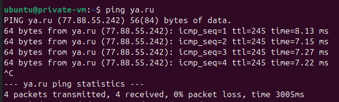

[Задание](https://github.com/netology-code/clopro-homeworks/blob/main/15.1.md)

### Подготовка
- Для работы с terraform настроить провайдера:
[Настройка Yandex провайдера terraform](https://yandex.cloud/ru/docs/tutorials/infrastructure-management/terraform-quickstart#configure-provider)

- Прописываем файл конфигурации `~/.terraformrc`:
```
provider_installation {
  network_mirror {
    url = "https://terraform-mirror.yandexcloud.net/"
    include = ["registry.terraform.io/*/*"]
  }
  direct {
    exclude = ["registry.terraform.io/*/*"]
  }
}

```
### Выполнение задания
##### Создаём terraform проект ([src](src))
- [providers.tf](src/providers.tf)
- [variables.tf](src/variables.tf)
- [locals.tf](src/locals.tf)
- [main.tf](src/main.tf)

##### Запускаем
```bash
terraform apply
```


##### Копируем ключ на публичную вм

```bash
scp -i ~/.ssh/id_ed25519 ~/.ssh/id_ed25519 ubuntu@130.193.50.63:~/.ssh/
```


##### Подключаемся к публичной vm и копируем тот же ключ на приватную vm
- С локальной:
```bash
ssh ubuntu@130.193.50.63
```
- На публичной
```bash
scp -i ~/.ssh/id_ed25519 ~/.ssh/id_ed25519 ubuntu@192.168.20.25:~/.ssh/
```


##### С публичной vm подключаемся к приватной:
```bash
ssh -i ~/.ssh/id_ed25519 ubuntu@192.168.20.25
```
##### Проверяем на приватной:
```bash
ping ya.ru
```
