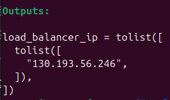
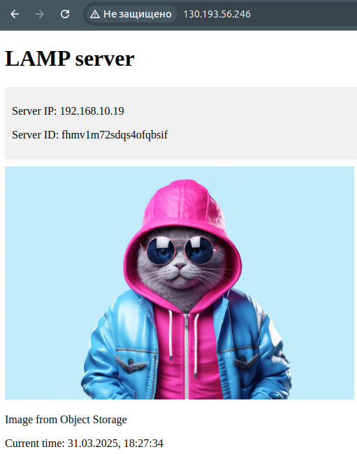
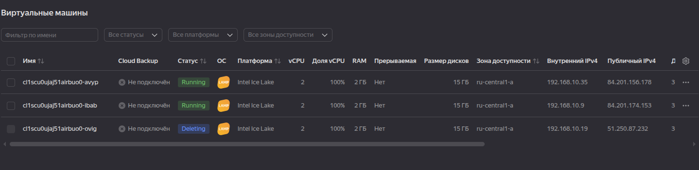
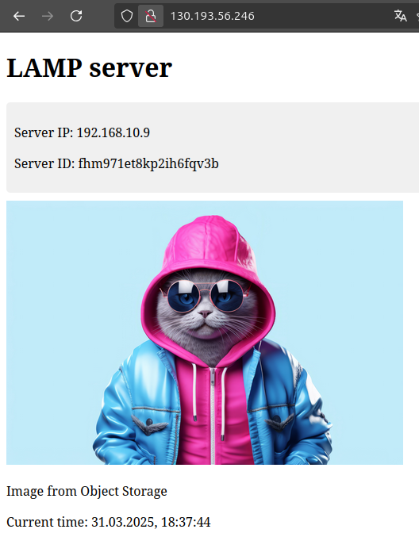

[Задание](https://github.com/netology-code/clopro-homeworks/blob/main/15.2.md)

### Создать бакет Object Storage и разместить в нём файл с картинкой
Создаём [providers.tf](src/providers.tf), [variables.tf](src/variables.tf), [s3.tf](src/s3.tf).

Запускаем

```bash
terraform init
terraform validate
terraform plan
terraform apply
```
Проверяем картинку в браузере:
```
https://sushkov-2025-03-30.website.yandexcloud.net/cat.jpg
```


### Создать группу ВМ в public подсети фиксированного размера с шаблоном LAMP и веб-страницей, содержащей ссылку на картинку из бакета:

Создаём [instance_group.tf](src/instance_group.tf) и [outputs.tf](src/outputs.tf)


### Подключить группу к сетевому балансировщику:
В [instance_group.tf](src/instance_group.tf) создаём балансировщик:
```hcl
resource "yandex_lb_network_load_balancer" "lamp_balancer" {
  name = "lamp-network-balancer"

  listener {
    name = "http-listener"
    port = 80
    external_address_spec {
      ip_version = "ipv4"
    }
  }

  attached_target_group {
    target_group_id = yandex_compute_instance_group.lamp_group.load_balancer.0.target_group_id

    healthcheck {
      name = "http"
      interval = 2
      timeout = 1
      unhealthy_threshold = 2
      healthy_threshold = 2

      http_options {
        port = 80
        path = "/"
      }
    }
  }
}

```
Запускаем, получаем IP балансировщика:  


Проверяем:  



Видим разные IP и Server ID, значит балансировщик работает, подгружает одну из ВМ.

Вручную удалить одну из машин:  


Проверяем:  

