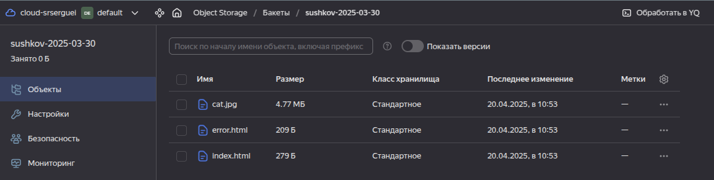
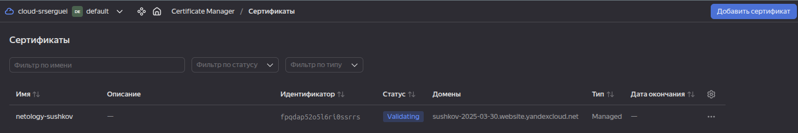
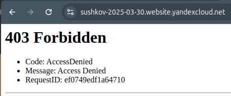
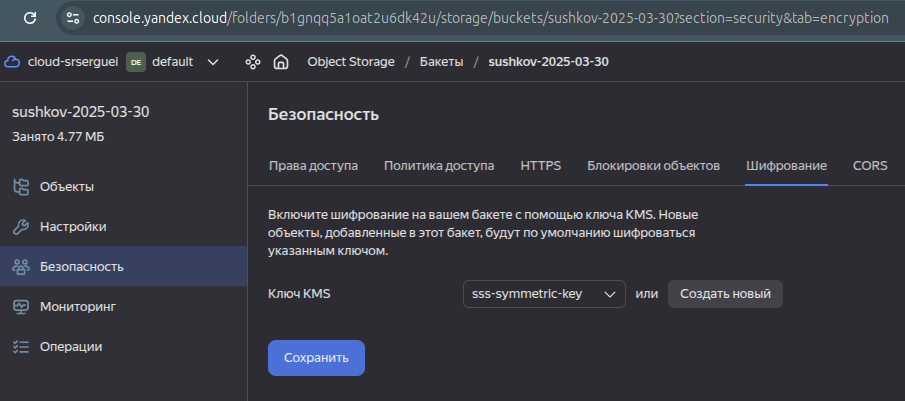

Продолжаем с кодом задания 2, копируя его в новую директорию [3](.)

Добавляем создание сервисного аккаунта, сертификата в [s3.tf](src/s3.tf)

Проверяем наличие файлов  

Проверяем наличие сертификата  

Страница не открывается из-за шифрования:  

Смотрим шифрование:  

